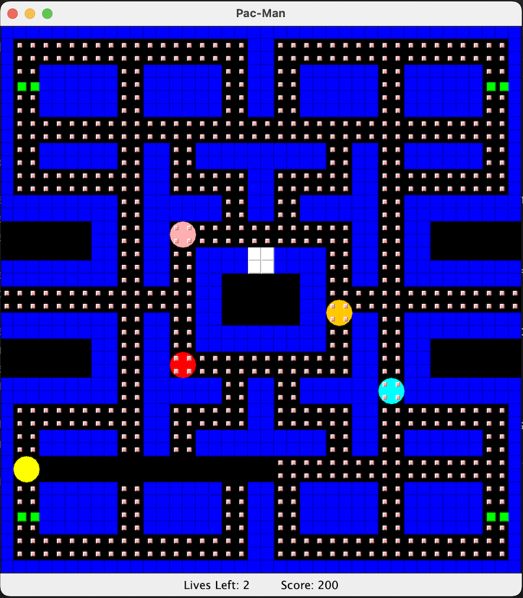

# PAC-MAN

*Old final project from my CIS120 Programming in Java course at the University of Pennsylvania. Built in Dec 2019, uploaded to GitHub in Aug 2023.*

A playable recreation of the classic game of Pac-Man, written in Java. Utilizes the 
Java Swing GUI framework.

<p align="center">
    
</p>

To run:
```
$ cd src
$ javac *.java
$ java Game.java
```

## Some core concepts used and the features they implement:

1. 2D arrays: The game board consists of a 2D array that stores the positions 
    of the walls and dots. Interactions between Pac-Man and the ghosts depend
    on their array positions.

2. File I/O: The top five high scores are kept track of in a separate .txt file
    and sorted in order of highest to lowest score.

3. Inheritance/subtyping for dynamic dispatch: The four ghosts (red, pink, cyan, 
    and orange) extend the abstract Ghost class. Each ghost subtype has an
    unique movement pattern, whose method can be called upon through dynamic 
    dispatch.

4. Testable component: JUnit tests are used to test movements and collisions of
    different objects.

## Class overviews:

- Direction - enum for the UP, DOWN, LEFT, and RIGHT directions.

- Dot - A consumable dot object.

- Game - The Pac-Man game main class that specifies the frame and widgets of the 
GUI.

- GameCourtPacman - This class holds the primary game logic for how different
objects interact with one another.

- GameCourtTest - JUnit tests for the GameCourtPacman class.

- GameObjPacman - An object in the Pac-Man game that exists in the game court. 
It has a position, size, and direction.

- GameObjectTest - JUnit tests for the GameObjPacman class.

- GhostCyan - A cyan ghost that follows a set path circling around the map.

- GhostOrange - An orange ghost that follows a random path.

- GhostPink - A pink ghost that will target and move towards the direction where 
Pac-Man is moving.

- GhostRed - A red ghost that will target Pac-Man and move towards it.

- Ghosts - An abstract ghost object in the game that extends GameObjPacman. Each 
ghost has a different color and a different movement pattern, whose method 
is abstract. Ghosts have a normal dangerous form and an edible blue form.

- Pacman - The Pac-Man object that the user controls; initializes at a specific 
position on the board.

- PacmanFileIterator - Allows reading and writing of high scores into a .txt file
one line at a time, with the name on one line and the corresponding score on 
the following line.

- Wall - A wall object; Pac-Man and ghosts cannot pass it.